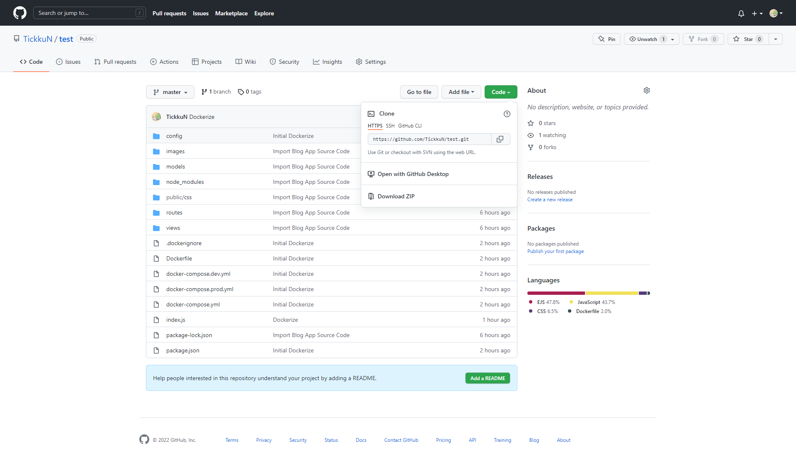
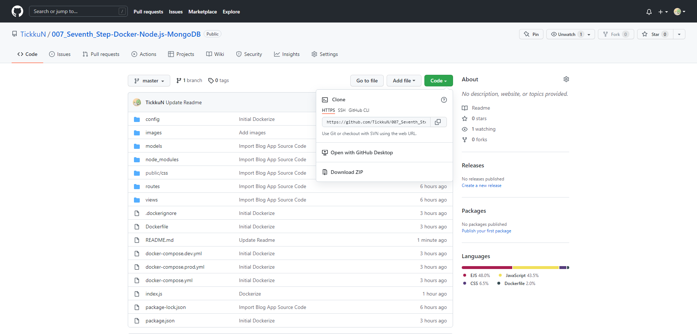

# 007_Seventh_Step-Docker-Node.js-MongoDB  
## 1. Install Docker Desktop on your PC  
<a href="https://www.docker.com/products/docker-desktop" target="_blank"> Docker Desktop </a>  
  
## 2. Download this repository on your PC and please decompress the Zip file  

<a href="https://github.com/TickkuN/007_Seventh_Step-Docker-Node.js-MongoDB/archive/refs/heads/master.zip" target="_blank">Download Zip File </a> 
  
## 3. Enter this command for development-mode  
  
docker-compose -f docker-compose.yml -f docker-compose.dev.yml up -d  

## 4. Enter this command for product-mode  
  
docker-compose -f docker-compose.yml -f docker-compose.prod.yml up -d  

## 5. Enjoy my app at "localhost:3000"  
 

